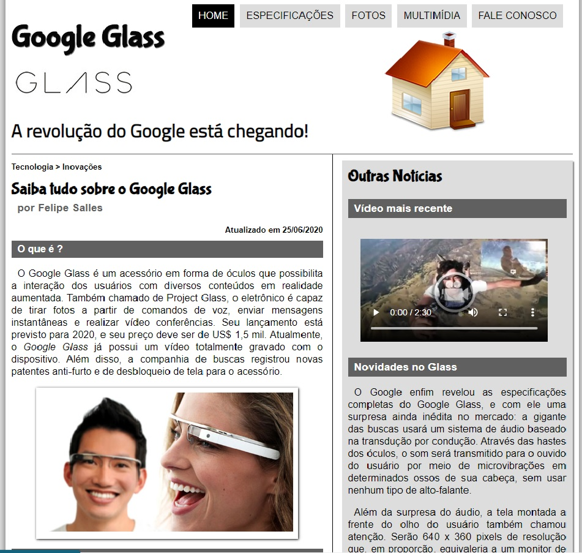
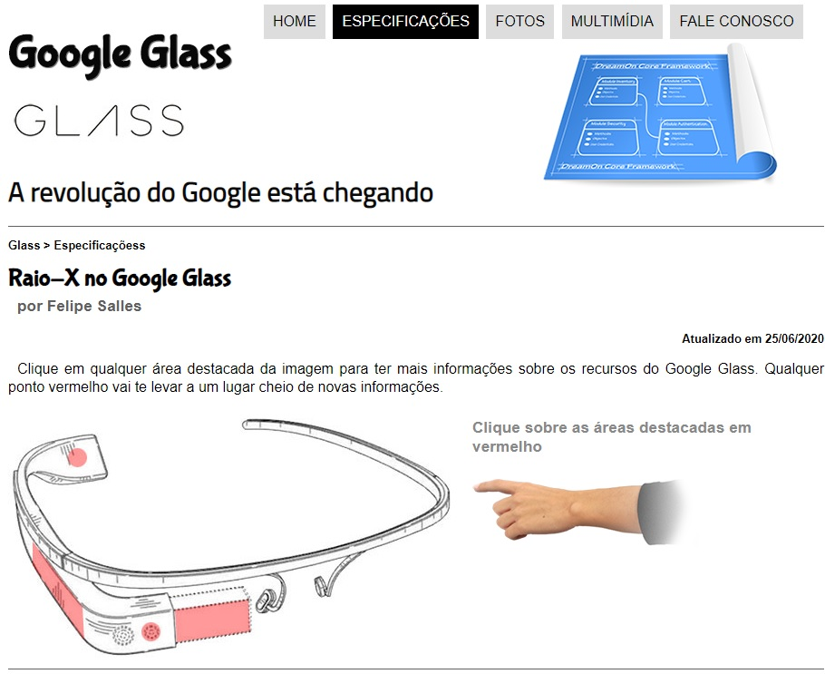
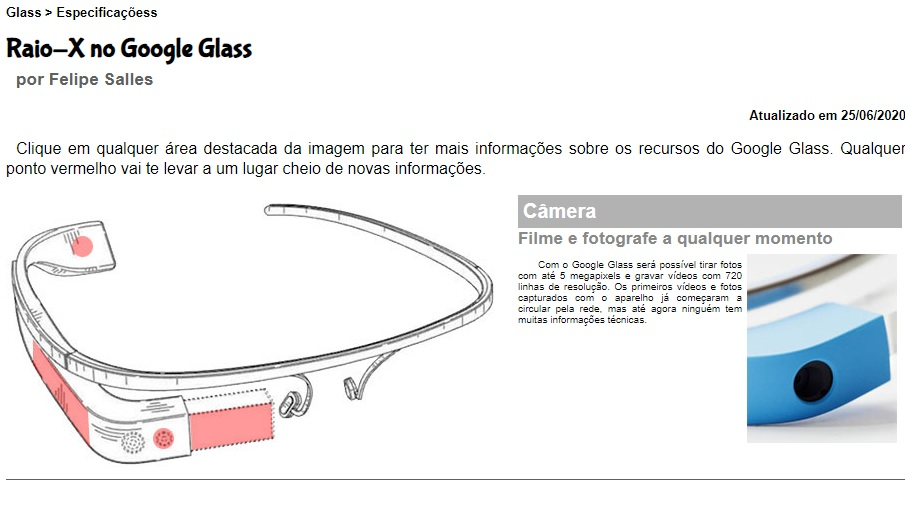
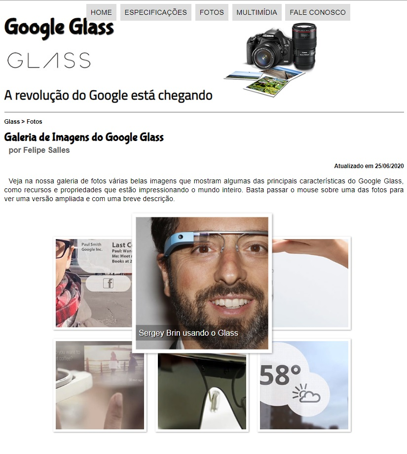
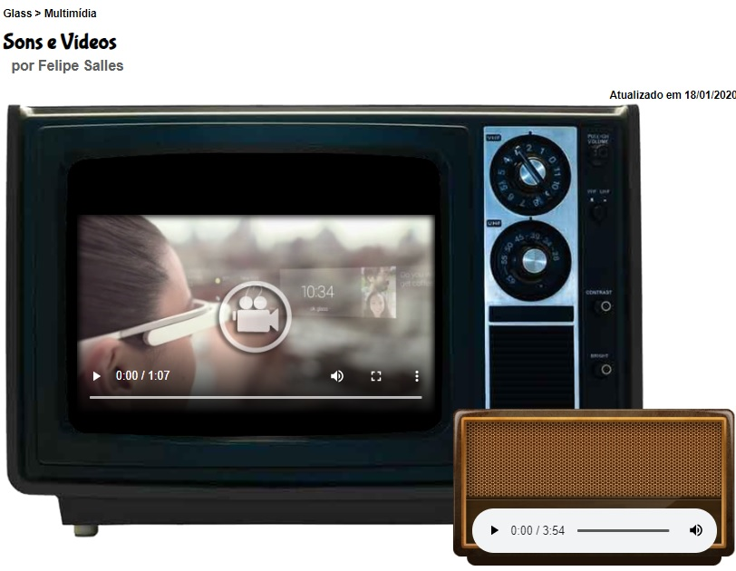
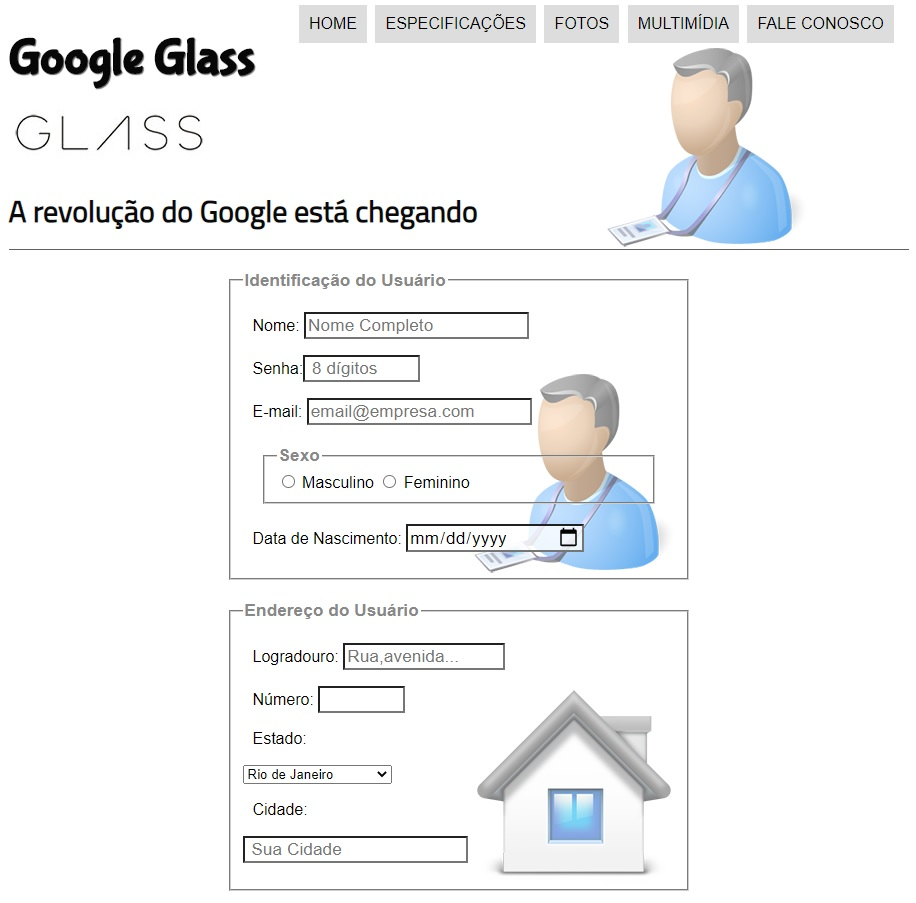
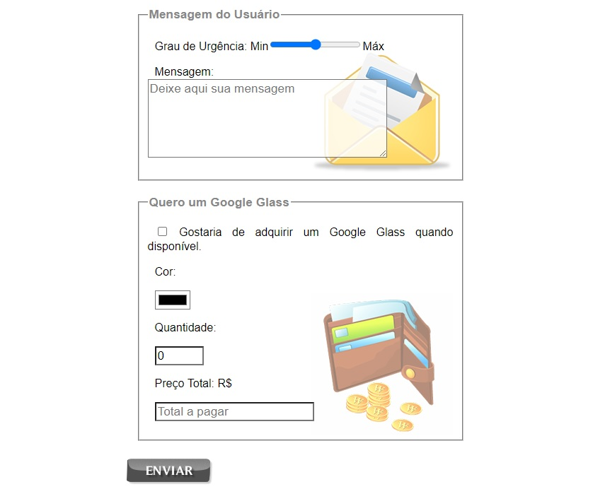

# Front End projects
My Front end projects.
# iTravel Website!

Hi! This is a project developed with the intetion to learn about **HTML and CSS**. It was an incredible experience to work with the design of the website as a whole and also to research and understand how to choose good colors to compose the website.

## Project

The main goals here were to learn the basics of HTML and CSS so that I could create my own website.
**Here are some nice things that I learned from the project:**
- Flexbox concepts:
  - The basics of flexbox, like: flex-direction, justify-content and align-items.
- How to integrate with Google Maps: 
  - The site contact section uses a map to show the address. So, I used Google Maps integration and documentation. 
 - Media queries:
   - All the website is responsive for smartphones, tablets and desktops.
## Desktop Behavior

## Mobile Behavior

# Google Glass Website
*First Project using HTML and CSS to create a simple website:*
 
**HOME | INÍCIO**

**SPECIFICATIONS | ESPECIFICAÇÕES**

**PHOTOS | FOTOS**

**MULTIMEDIA | MULTIMÍDIA**

**CONTACT US | FALE CONOSCO**

**Thank  you | Obrigado!**
